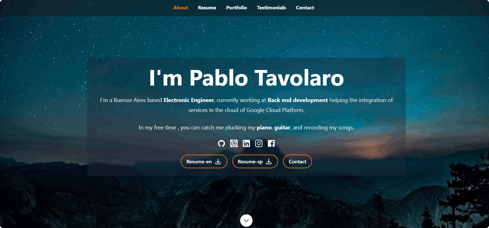
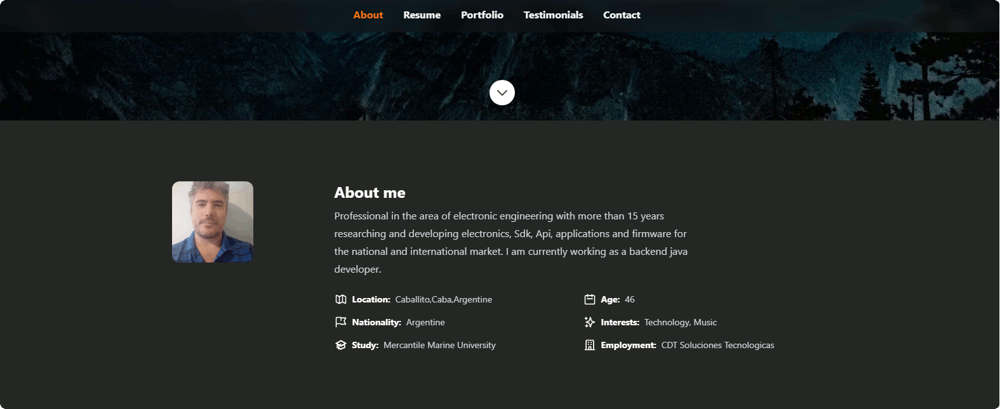
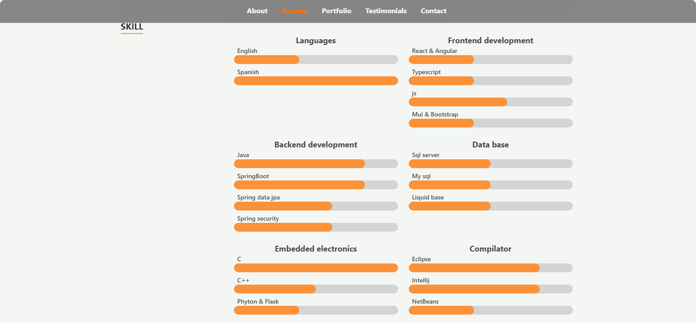
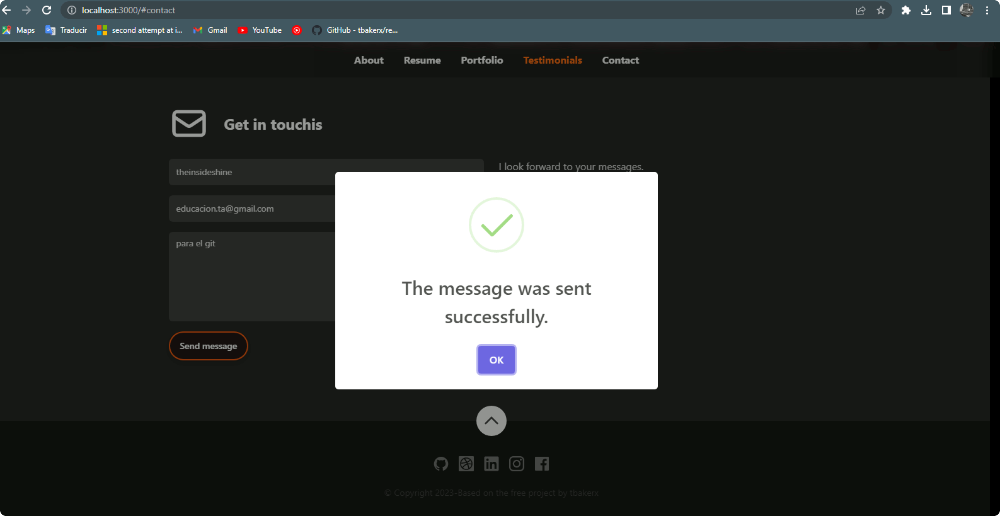

# React Configurable Resume Builder

The intent of this project is to build the architecture for a configurable resume builder.

The free project of tbakerx was used as a base,
In it, the data of the sections and users are static, necessary modifications were added so that the data is brought from a backend.

Hero Section
Added the download of the resume in pdf format in English or Spanish

About Section

About Resume

About Portfolio

About Testimonial

About Contact
Added support for sending email, using the sendgrid provider

Backend repository Microservices ecosystem:

 https://github.com/theinsideshine/springcloud-config-resume

